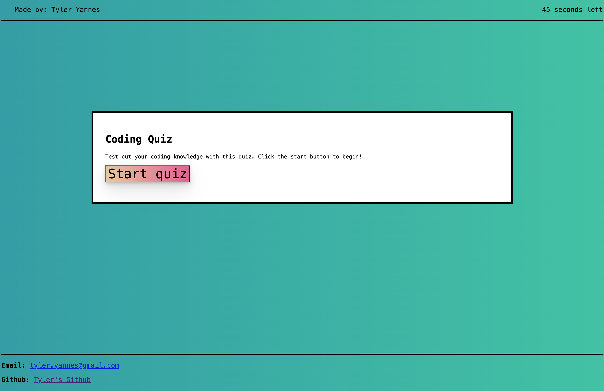

# Coding Quiz Assignment
This is a repo for my bootcamp's 4th weekly challenge.

## User Story

```
AS A coding boot camp student
I WANT to take a timed quiz on JavaScript fundamentals that stores high scores
SO THAT I can gauge my progress compared to my peers
```

## Acceptance Criteria

```
GIVEN I am taking a code quiz
WHEN I click the start button
THEN a timer starts and I am presented with a question
WHEN I answer a question
THEN I am presented with another question
WHEN I answer a question incorrectly
THEN time is subtracted from the clock
WHEN all questions are answered or the timer reaches 0
THEN the game is over
WHEN the game is over
THEN I can save my initials and my score
```

## Webpage Overview
- Header: Contains a countdown timer to let you know the time remaining to complete the quiz.
- Main Content: Displays questions, multiple choice answers, and relevant buttons to proceed through the quiz.
- Footer: Provides feedback about the correctness of answers and has the feature to input your initials to save your score.

## App Structure and Features
- Javascript Logic: This app is powered by Vanilla JavaScript. The logic behind the questions, answers, and scoring system can be found in the provided JS code.
- Timer: Starts once the quiz begins and decrements every second. If a wrong answer is selected, 10 seconds are subtracted from the timer.
- Question Navigation: The user can navigate between questions using the Next button. After the last question, the user's score is displayed.
- Saving Scores: Users can save their scores along with their initials. The scores are saved in the browser's local storage.
- Styling: The look and feel of the app are defined using CSS. The main styling can be found in ./assets/style.css.
- Web Page Structure: The structure of the webpage is defined using HTML. It sets up the layout for questions, answers, and other quiz components.

## App screenshot
